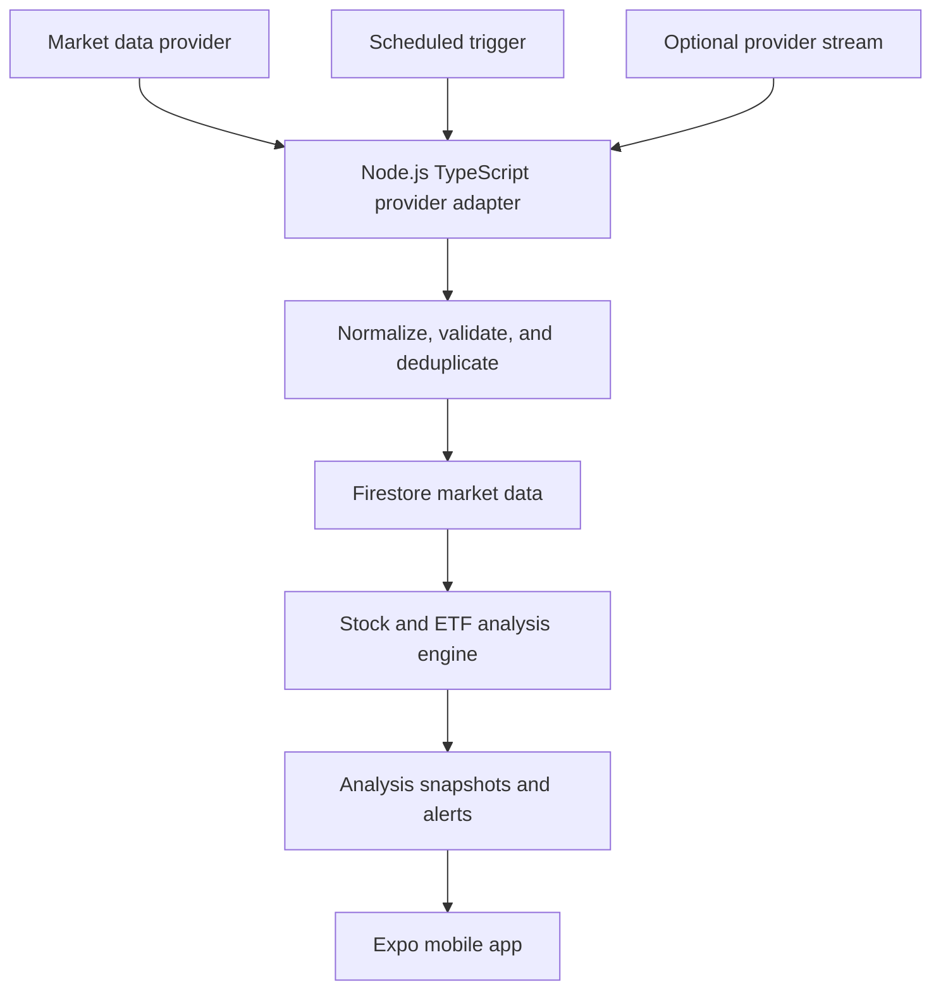

# System Architecture

## 1. Existing application context

The target repository is an Expo/React Native TypeScript app using Firebase Authentication and Cloud Firestore. Existing Firestore rules protect `users/{userId}/holdings` and `users/{userId}/portfolioMeta`. The stock-analysis feature is not yet implemented; provider, backend runtime, and market-data licensing are undecided.

## 2. Proposed components

### Mobile client

- Uses Firebase Authentication for user identity.
- Reads permitted market summaries and the signed-in user's holdings, watchlist, alert rules, and alerts.
- Never contains provider API secrets or writes trusted market/analysis values directly.
- Displays source, as-of time, and freshness state for market-derived information.

### Ingestion and analysis service

- TypeScript service with provider-neutral interfaces.
- Scheduled quote/history/fundamental/event jobs for the first release.
- Optional long-running WebSocket consumer only if provider entitlement and user need justify it.
- Validates, normalizes, stores, runs analyses, evaluates alerts, and records operational job outcomes.
- Stores credentials in server-side secret management; redact them from logs.

### Firestore

- Shared market data and analysis records are distinct from user-private records.
- Backend service writes authoritative quotes and analysis.
- Client security rules allow only explicitly intended reads and owner-scoped user data access.
- Use server timestamps and deterministic keys to make retries idempotent.

## 3. Update model

| Data | Initial update approach | Freshness shown to user |
|---|---|---|
| Quotes | Provider-supported scheduled polling during market sessions; cadence set by provider limits and product need | Provider timestamp plus received time; live/delayed/end-of-day status |
| Historical bars | Scheduled refresh and backfill on demand | Bar interval and latest completed bar time |
| Financial statements/fund facts | Scheduled lower-frequency refresh and event-triggered refresh if available | Fiscal period, publication/as-of date, retrieval time |
| Distributions/corporate actions | Scheduled/event refresh | Announcement/effective/payment dates and source time |
| ETF holdings | Scheduled refresh at provider cadence | Holdings effective date; look-through marked stale when over policy |

“Live” is a provider entitlement and exchange-specific property, not an app-controlled guarantee. Verify exact JSE/international symbols, redistribution rights, user display rights, latency, rate limits, and cost before choosing a provider.

## 4. Provider adapter contract

Each adapter should expose operations equivalent to:

- `searchAssets(query, marketFilters)`
- `getQuote(assetProviderId)`
- `getHistoricalBars(assetProviderId, interval, range)`
- `getCompanyFacts(assetProviderId, periods)`
- `getFundFacts(assetProviderId)`
- `getDistributions(assetProviderId, range)`
- `getHoldings(assetProviderId, asOf)`
- `getEvents(assetProviderId, since)`

Provider-specific response shapes map into canonical domain types. Keep rate limiting, retry with backoff, error classification, and provider request IDs inside the adapter boundary.

## 5. Reliability and security

- Make ingestion idempotent; repeated provider responses must not duplicate bars, events, or alerts.
- Enforce timeouts and bounded retries; record failures without replacing good data with null/zero.
- Track last success and last attempted time per provider/data type.
- Monitor stale market data, provider failures, error rate, job duration, and Firestore writes.
- Apply owner-only access to user data and deny client writes to provider data and analysis.
- Add Firestore rules and emulator tests before exposing new collections to the app. Existing rules do not yet cover these collections.
- Keep notification delivery separate from alert calculation so delivery can retry safely.

## 6. Deployment decision

For scheduled calls, use a managed job/function model compatible with the app's Firebase environment. A persistent container/service is required if maintaining a long-lived provider WebSocket. Choose the runtime after provider choice, update needs, and expected cost are known; do not add a streaming worker to the MVP by default.
