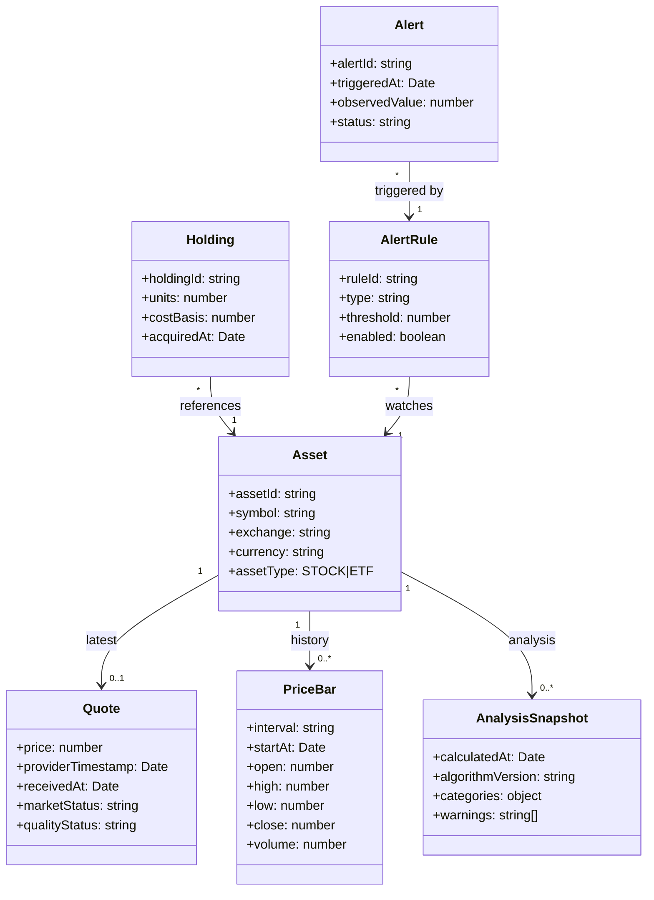
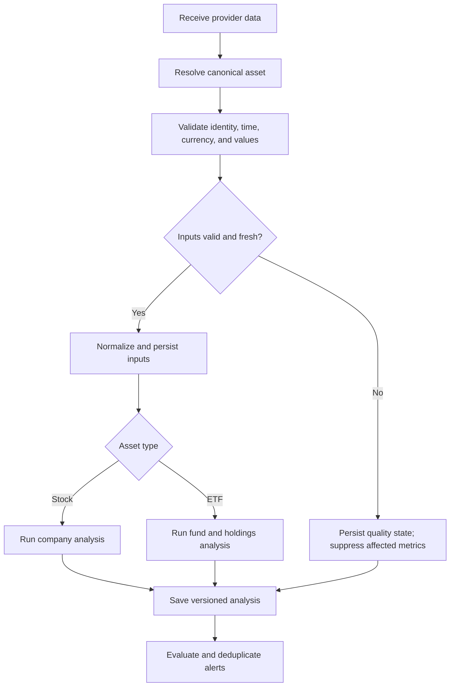
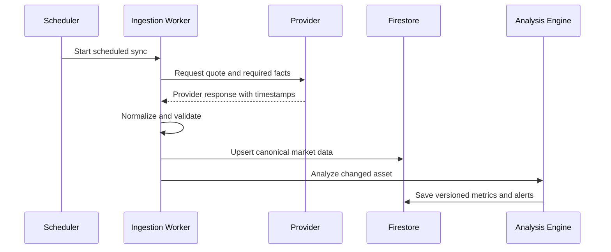

# UML Models

## 1. Use cases

**Portfolio owner**

- Manage a mixed stock/ETF watchlist.
- Inspect asset details and data freshness.
- Compare assets and review portfolio exposures.
- Create and manage alerts.
- View, dismiss, or revisit alert history.

**Ingestion worker**

- Synchronize provider data.
- Validate and persist market inputs.
- Run asset-specific analysis.
- Evaluate and deduplicate alert rules.
- Record sync health and errors.

## 2. Domain class diagram

## 3. Analysis activity

## 4. Quote update sequence

